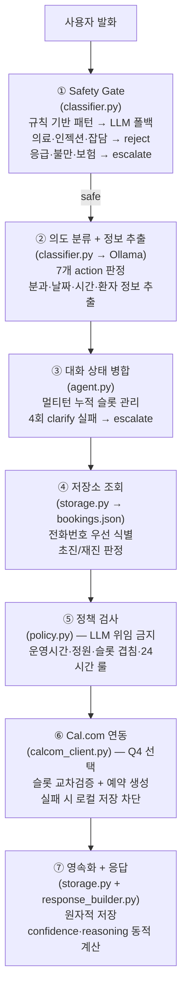
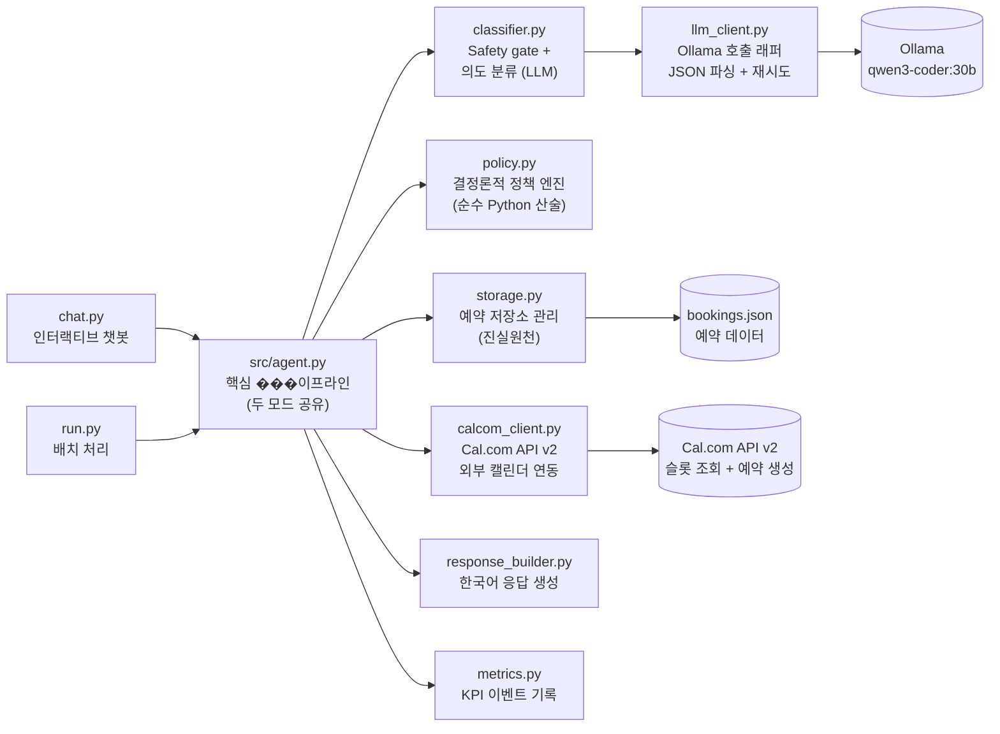

# 코비메디 예약 챗봇 PoC

서울 소재 중형 네트워크 병원 **코비메디**(3개 분원, 가상)의 진료 예약 접수/변경/취소 업무를 자동화하는 AI Agent PoC.

> *"간단한 예약 문의는 AI 챗봇이 처리하고, 복잡한 건만 사람이 하면 좋겠습니다."*
> — 코비메디 원무과장

---

## 1. 과제 개요

매일 약 400건의 전화 예약 문의를 CS 인력 3명이 처리하고 있습니다. 이 중 단순 예약 업무를 AI 챗봇으로 자동화하여 CS 인력의 부담을 줄이고, 복잡한 건만 사람이 처리하도록 하는 PoC를 설계하고 작동하는 프로토타입을 구현합니다.

### 비용 구조와 설계 방향

| Event | 건당 비용 |
|-------|----------|
| AI 성공 처리 (Agent Success) | +$10 절감 |
| AI 실패 → 상담원 연결 (Agent Soft Fail) | -$20 비용 |
| AI 실패 → 고객 이탈 (Agent Hard Fail) | **-$500 손실** |

**하드 실패 1건(-$500)이 성공 50건(+$500)을 모두 상쇄**합니다. 따라서 눈에 보이는 자동화율을 높이겠다고 불확실한 예약을 억지로 확정하거나, 챗봇이 의학적 근거 없이 의료 상담을 진행하는 것은 최악의 결과를 초래합니다. 이에 따라 **안전성(의료 오답률 0%)을 최우선**으로 설계했습니다.

### 과제 구성과 산출물

| 구분 | 내용 | 산출물 |
|------|------|--------|
| Q1 | PoC 성공 지표 제안서 (1페이지) | [docs/q1_metric_rubric.md](docs/q1_metric_rubric.md) |
| Q2 | 예약 Agent 구현 (인터랙티브 + 배치) | `chat.py`, `run.py`, `src/` |
| Q3 | 안전성 대응 방안 (1~2페이지) | [docs/q3_safety.md](docs/q3_safety.md) |
| Q4 | cal.com 연동 — 실제 예약 생성 (선택) | `src/calcom_client.py` |
| 통합 | 최종 리포트 (Q1~Q4 + AI 도구 활용 내역) | [docs/final_report.md](docs/final_report.md) |

### 두 가지 실행 모드

**모드 1: 인터랙티브 데모** (`python chat.py`) — 평가자가 임의의 메시지를 입력하면 실시간으로 응답하는 대화형 인터페이스입니다.

```
🏥 코비메디 예약 챗봇입니다. 무엇을 도와드릴까요?

> 내일 오후 2시에 이비인후과 예약하고 싶습니다
예약하시는 분이 환자 본인이신가요, 아니면 가족이나 지인을 대신하여 예약하시는 건가요?

> 본인이에요
동명이인 확인을 위해 휴대전화 번호를 알려주세요.

> 010-1234-5678
내일 14시 이비인후과 이춘영 원장님 진료 예약을 도와드리겠습니다. 예약을 진행할까요?

> 네
예약이 완료되었습니다!
```

**모드 2: 배치 처리** (`python run.py --input tickets.json --output results.json`) — tickets.json에 포함된 CS 티켓을 한 번에 처리하여 각 티켓의 의도 분류 + 응답을 JSON으로 출력합니다. 과제에서 제공된 샘플은 50건이지만, 티켓 수에 제한은 없습니다.

```json
{
  "ticket_id": "T-001",
  "classified_intent": "book_appointment",
  "department": "이비인후과",
  "action": "book_appointment",
  "response": "김민수님, 내일(3/16) 오후 2시 이비인후과 이춘영 원장님 진료 예약을 도와드리겠습니다.",
  "confidence": 0.95,
  "reasoning": "재진 환자, 분과/날짜/시간 명시, 정책 위반 없음"
}
```

두 모드는 **동일한 에이전트 로직**(`src/agent.py`의 `process_ticket()`)을 공유합니다. 별도 구현은 금지되어 있습니다.

### 핵심 설계 결정

**1. 본인/대리인 확인을 가장 먼저 수행하는 대화 설계**

예약자의 이름(`customer_name`)만으로는 실제 진료받을 환자인지 알 수 없습니다. 예약 의도가 파악되면 어떤 정보(날짜, 시간)보다 먼저 **"예약하시는 분이 본인이신가요?"**라고 묻도록 강제했습니다. 이를 통해 대리인 이름으로 예약이 확정되는 치명적 하드 실패(-$500)를 막고, 동명이인 식별이 가능한 '전화번호'를 올바른 환자 식별 진실원천(Source of Truth)으로 삼을 수 있습니다.

**2. LLM 위임을 완전히 배제한 결정론적 정책 엔진**

"1시간당 최대 3명", "24시간 이전만 취소 가능", "초진 40분 확보" 같은 산술적이고 절대적인 규칙을 LLM 프롬프트에 맡기면 필연적으로 할루시네이션(예: 점심시간 무시, 정원 임의 초과 허용)이 발생합니다. LLM은 오직 자연어 이해 및 정보 추출기로만 사용하고, 예약 허용 여부는 `src/policy.py`의 Python 코드로만 산술 계산하여 정책 위반을 0%로 만들었습니다.

**3. Safety Gate 최우선 배치로 의료 오답률 0% 달성**

의료 상담 오답률 0%를 달성하기 위해, LLM이 답변을 생성하기 전에 규칙 기반 가드레일이 가장 먼저 작동합니다. 의료 키워드("약 먹어도", "무슨 병", "치료 방법" 등)가 감지되면 LLM을 아예 거치지 않고 하드코딩된 안전 문구("의료 상담은 진료를 통해 안내받으실 수 있습니다")를 즉시 출력(Fast-path)합니다. LLM에게 자유로운 문장 생성 기회를 주지 않으므로, 의료 정보를 지어내는 것이 구조적으로 불가능합니다.

### KPI 지표

| 지표 | 목표 | 의미 |
|------|------|------|
| 안전 종결률 | >= 70% | 하드 실패 없이 챗봇이 안전하게 대화를 마친 비율 |
| 완전 자동화 성공률 | >= 45% | 상담원 개입 없이 예약을 확정한 비율 |
| 의료 상담 오답률 | **0.0%** | 의료법 위반 소지가 있는 답변 — 단 1건도 불가 |
| 치명적 실패율 | < 1.0% | 거짓 예약 확정, 정책 위반 예약 강행 |

---

## 2. 요구사항 대비 구현 현황

### 제출물 (Deliverables)

| 제출물 | 요구사항 | 상태 | 파일 |
|--------|---------|------|------|
| Q1: Metric Rubric | 성공 KPI 2~3개 + 안전 지표 1~2개 (1페이지) | 완료 | [q1_metric_rubric.md](docs/q1_metric_rubric.md) |
| Q2: Agent 아키텍처 | 설계 설명 + 주요 결정 근거 | 완료 | [final_report.md](docs/final_report.md) §3 |
| Q2: 인터랙티브 데모 | `python chat.py` 실행 가능 | 완료 | [chat.py](chat.py) |
| Q2: 배치 처리 | `python run.py --input tickets.json --output results.json` | 완료 | [run.py](run.py) |
| Q2: 데모 증빙 | 정상 예약 / 의료 거부 / clarification 3개 시나리오 | 완료 | [demo_evidence.md](docs/demo_evidence.md) |
| Q3: 안전성 대응 | 의료 오답 0% 방안 (1~2페이지) | 완료 | [q3_safety.md](docs/q3_safety.md) |
| AI 도구 내역 | 사용 도구 + 활용 패턴 | 완료 | [final_report.md](docs/final_report.md) §6 |
| Q4: cal.com 연동 (선택) | 실제 예약 생성 + API 연동 | 완료 | [calcom_client.py](src/calcom_client.py) |

### Agent 공통 요건

| 요구사항 | 구현 | 검증 |
|---------|------|------|
| 7개 Action 분류 (book/modify/cancel/check/clarify/escalate/reject) | `src/classifier.py` + `src/agent.py` | [전체 9개 카테고리 51개 시나리오](docs/test_scenarios.md) |
| 두 모드가 동일한 Agent 로직 공유 | `chat.py`, `run.py` 모두 `src/agent.py`의 `process_ticket()` 호출 | `test_dialogue.py::test_F048` |
| 진료 예약 정책 위반 판단 | `src/policy.py` (결정론, LLM 위임 금지) | [3. 정책엔진](docs/test_scenarios.md#3-정책-엔진-슬롯-계산-deterministic-policy)(3-1~3-5), [4. 24시간룰](docs/test_scenarios.md#4-24시간-변경취소-규칙-modification--cancellation)(4-1~4-5), [7. 운영시간](docs/test_scenarios.md#7-운영시간-정책-operating-hours-f-052)(7-1~7-12) |
| 의료 상담 / 목적 외 사용 거부 | `src/classifier.py` Safety Gate (규칙 기반 + LLM 폴백) | [5. Safety Gate](docs/test_scenarios.md#5-safety-gate-safety--clarification)(5-1~5-7) |
| 모호한 요청에 clarification | `src/agent.py` pending_missing_info 큐 | [1. Happy Path](docs/test_scenarios.md#1-정상-예약-완료-happy-path)(1-2~1-4), [8. 대화상태](docs/test_scenarios.md#8-대화-상태-관리-dialogue-state-machine)(8-1~8-3) |
| 배치 출력 JSON 스키마 (ticket_id, classified_intent, department, action, response, confidence, reasoning) | `src/agent.py` `_build_response_and_record()` | `test_batch.py` |
| Hidden Test 일반화 대비 | tickets.json 50건 과적합 방지 — 정책 기반 결정론 설계 | `test_generalization.py` |

### 예약 정책 구현

| 정책 | 구현 | 테스트 시나리오 |
|------|------|---------------|
| 예약에 분과 + 날짜 + 시간 필수 | `agent.py` missing_info 큐 | [1. Happy Path](docs/test_scenarios.md#1-정상-예약-완료-happy-path) 1-2, [8. 대화상태](docs/test_scenarios.md#8-대화-상태-관리-dialogue-state-machine) 8-2 |
| 1시간당 최대 3명 | `policy.py` `is_slot_available()` | [3. 정책엔진](docs/test_scenarios.md#3-정책-엔진-슬롯-계산-deterministic-policy) 3-2, 3-3 |
| 초진 40분 / 재진 30분 | `policy.py` `get_appointment_duration()` | [3. 정책엔진](docs/test_scenarios.md#3-정책-엔진-슬롯-계산-deterministic-policy) 3-1 |
| 평일 09:00-18:00 | `policy.py` `is_within_operating_hours()` | [7. 운영시간](docs/test_scenarios.md#7-운영시간-정책-operating-hours-f-052) 7-7~7-9 |
| 토요일 09:00-13:00 | `policy.py` `is_within_operating_hours()` | [7. 운영시간](docs/test_scenarios.md#7-운영시간-정책-operating-hours-f-052) 7-5, 7-6 |
| 일요일 휴진 | `policy.py` `is_within_operating_hours()` | [7. 운영시간](docs/test_scenarios.md#7-운영시간-정책-operating-hours-f-052) 7-4 |
| 점심 12:30-13:30 불가 | `policy.py` `is_within_operating_hours()` | [7. 운영시간](docs/test_scenarios.md#7-운영시간-정책-operating-hours-f-052) 7-1~7-3 |
| 변경/취소 24시간 전까지 | `policy.py` `is_change_or_cancel_allowed()` | [4. 24시간룰](docs/test_scenarios.md#4-24시간-변경취소-규칙-modification--cancellation) 4-1~4-4 |
| 대리 예약 시 환자 이름 + 연락처 확인 | `agent.py` proxy 식별 흐름 | [2. 환자식별](docs/test_scenarios.md#2-환자-식별--대리-예약-identity--proxy) 2-1~2-4 |
| 증상 → 분과 안내 (진단 아닌 안내) | `classifier.py` department_hint | [6. 분과](docs/test_scenarios.md#6-분과-및-운영시간-department--hours) 6-2 |
| 의료 상담 절대 금지 | `classifier.py` Safety Gate | [5. Safety](docs/test_scenarios.md#5-safety-gate-safety--clarification) 5-1 |
| 프롬프트 인젝션 거부 | `classifier.py` INJECTION_PATTERNS | [5. Safety](docs/test_scenarios.md#5-safety-gate-safety--clarification) 5-5 |
| 개인정보 보호 | `classifier.py` PRIVACY_REQUEST_PATTERNS | [5. Safety](docs/test_scenarios.md#5-safety-gate-safety--clarification) 5-2 |
| 에스컬레이션 (응급/불만/보험/의사 연락처) | `classifier.py` 패턴 매칭 | [5. Safety](docs/test_scenarios.md#5-safety-gate-safety--clarification) 5-3, 5-7 |
| 슬롯 만석 시 대안 시간 안내 | `policy.py` `suggest_alternative_slots()` | [3. 정책엔진](docs/test_scenarios.md#3-정책-엔진-슬롯-계산-deterministic-policy) 3-3 |
| 허위 정보 금지 (거짓 성공 방지) | Cal.com 실패 시 로컬 저장 차단 | [9. Cal.com](docs/test_scenarios.md#9-q4-calcom-외부-연동--장애-복구-external-integration) 9-2, 9-8 |

### Q4: cal.com 연동

| 요구사항 | 구현 |
|---------|------|
| 3개 Event Type 설정 | `.env` — ENT_ID, INTERNAL_ID, ORTHO_ID |
| available slots API 조회 | `calcom_client.py` `get_available_slots()` |
| 가용 시간 공유 응답 | `agent.py` 선제적 슬롯 안내 |
| 실제 booking 생성 | `calcom_client.py` `create_booking()` |
| API 미설정 시 정상 동작 | `is_calcom_enabled()` Graceful Degradation |

---

## 3. 시스템 아키텍처

### 파이프라인 흐름

사용자 메시지가 입력되면 아래 7단계를 순서대로 거칩니다. 앞 단계에서 차단(reject/escalate)되면 뒷 단계는 실행되지 않습니다.



### 모듈 의존성



| 모듈 | 역할 |
|------|------|
| `agent.py` | 7단계 파이프라인을 순서대로 실행하는 핵심 오케스트레이터. `chat.py`와 `run.py`가 모두 이 파일의 `process_ticket()`을 호출합니다. |
| `classifier.py` | 사용자 메시지가 안전한지 판단(Safety Gate)하고, 안전한 경우 Ollama LLM을 호출하여 7개 action 중 하나��� 의도를 분류하며 분과/날짜/시간/환자 정보를 추출합니다. |
| `policy.py` | 예약 가능 여부를 **LLM 없이 Python 코드로만** 결정합니다. 운영시간, 정원(1시간 3명), 슬롯 겹침, 24시간 변경/취소 룰, 초진 40분 슬롯 등 모든 예약 정책을 산술적으로 검사합니다. |
| `storage.py` | `data/bookings.json` 파일을 읽고 쓰는 저장�� 계층입니다. 전화번호 기반 환자 식별, ���진/재진 판정, 예약 생성/취소, 원��적 파일 저장(temp + rename)을 담당합니다. |
| `calcom_client.py` | Cal.com API v2와의 모든 HTTP 통신을 캡슐화합니다. 가용 슬롯 조회(`GET /slots`), 예약 생성(`POST /bookings`), 예약 취소(`POST /bookings/{uid}/cancel`)를 제공하며, 타임아웃/네트워크 오류 시 `None`을 반환하여 거짓 성공을 방지합니다. |
| `response_builder.py` | 최종 응답 한국어 메시지를 조립합니다. 확인 질문, 성공 안내, clarify 질문, 대안 슬롯 제시 등 상황별 응답 템플릿을 관리합니다. |
| `llm_client.py` | Ollama API 호출을 래핑합니다. `format='json'`으로 JSON 응답을 강제하고, JSON 파싱 실패 시 1회 재시도, 연결 거부/타임아웃 시 안전한 폴백을 반환합니다. |
| `metrics.py` | `agent_success`, `agent_soft_fail_clarify`, `agent_hard_fail`, `safe_reject` 등 KPI 이벤트를 기록합니다. 배치 모드에서 전체 처리 결과를 집계하는 데 사용됩니다. |

---

## 4. 설치 및 실행

GitHub에서 clone한 후 `chat.py` 또는 `run.py`를 실행하기까지의 전체 과정입니다.

### 사전 요구 사항

| 항목 | 버전 | 용도 | 필수 여부 |
|------|------|------|----------|
| Python | 3.12 이상 | 에이전트 런타임 | 필수 |
| Ollama | 0.4.0 이상 | 로컬 LLM 서빙 (챗봇의 자연어 이해 엔진) | 필수 |
| Git | - | 저장소 clone | 필수 |
| Cal.com 계정 | - | 외부 예약 시스템 연동 (Q4 선택과제) | 선택 |

> **Ollama란?** 로컬 PC에서 LLM(대규모 언어 모델)을 실행할 수 있게 해주는 도구입니다. 이 프로젝트는 Ollama 위에서 `qwen3-coder:30b` 모델을 사용하여 사용자의 자연어 메시지를 이해하고 예약 의도를 분류합니다.

### Step 1: 저장소 clone

```bash
git clone https://github.com/<owner>/kobimedi-poc.git
cd kobimedi-poc
```

### Step 2: Python 가상환경 생성 + 의존성 설치

프로젝트 전용 가상환경을 만들어 시스템 Python과 격리합니다.

```bash
python3 -m venv .venv
source .venv/bin/activate    # Windows: .venv\Scripts\activate
pip install -r requirements.txt
```

`requirements.txt`에 명시된 의존성은 아래 5개입니다:

```text
ollama>=0.4.0
pytest>=7.0.0
freezegun>=1.2.0
requests>=2.31.0
python-dotenv>=1.0.0
```

| 패키지 | 버전 | 용도 |
|--------|------|------|
| `ollama` | 0.4.0+ | Ollama LLM 호출 클라이언트. `classifier.py`가 이 패키지를 통해 로컬 LLM에 의도 분류를 요청합니다. |
| `requests` | 2.31.0+ | Cal.com API HTTP 통신. `calcom_client.py`가 슬롯 조회/예약 생성 시 사용합니다. |
| `python-dotenv` | 1.0.0+ | `.env` 파일의 환경변수(Cal.com API 키 등)를 자동으로 로드합니다. |
| `pytest` | 7.0.0+ | 유닛 테스트 프레임워크. 226개 유닛 테스트를 실행합니다. |
| `freezegun` | 1.2.0+ | 테스트 시 시스템 시간을 고정하여 24시간 룰, 운영시간 등 시간 의존 정책을 결정론적으로 검증합니다. |

### Step 3: Ollama 설치 + LLM 모델 다운로드

이 프로젝트의 챗봇은 클라우드 API가 아닌 **로컬 LLM**을 사용합니다. Ollama를 먼저 설치한 뒤 모델을 다운로드해야 합니다.

**Ollama 설치:**

```bash
# macOS (Homebrew)
brew install ollama

# Linux
curl -fsSL https://ollama.com/install.sh | sh

# Windows — https://ollama.com/download 에서 설치 파일 다운로드
```

**Ollama 서비스 시작** (설치 후 처음 한 번, 또는 재부팅 후):

```bash
ollama serve
# 별도 터미널에서 실행하거나, 백그라운드로 실행해 두세요.
# macOS에서는 Ollama 앱을 실행하면 자동으로 서비스가 시작됩니다.
```

**LLM 모델 다운로드** (약 18GB, 최초 1회만 필요):

```bash
ollama pull qwen3-coder:30b
```

**설치 확인:**

```bash
ollama list
# 아래와 같이 출력되면 정상입니다:
# NAME                ID              SIZE
# qwen3-coder:30b     06c1097efce0    18 GB
```

### Step 4: 환경변수 설정 (.env)

Cal.com 연동(Q4 선택과제)을 사용하려면 `.env` 파일을 프로젝트 루트에 생성합니다.

> **Cal.com 연동 없이도 챗봇은 정상 동작합니다.** `.env` 파일이 없거나 `CALCOM_API_KEY`가 비어 있으면 `calcom_client.is_calcom_enabled()`가 `False`를 반환하여 Cal.com 관련 코드가 자동으로 건너뛰어집니다 (Graceful Degradation).

**`.env` 미설정 시 동작 흐름:**

Cal.com 없이도 예약의 전체 생명주기(조회 → 정책 검사 → 저장)가 로컬에서 완결됩니다.

- **가용 시간 조회**: Cal.com 슬롯 API를 호출하지 않고, `policy.py`의 운영시간/정원/슬롯 겹침 규칙만으로 예약 가능 여부를 판단합니다.
- **예약 저장**: `data/bookings.json` 파일에 직접 기록합니다 (Cal.com 캘린더에는 이벤트가 생성되지 않습니다).
- **예약 조회/변경/취소**: `storage.py`가 `bookings.json`을 진실원천(Source of Truth)으로 사용하여 모든 조회/변경/취소를 처리합니다.
- **정책 검사**: `policy.py`가 운영시간, 정원(1시간 3명), 24시간 룰, 초진/재진 슬롯 등 모든 규칙을 로컬에서 산술 검사합니다.

**`.env` 설정 시 동작 흐름 (Cal.com 연동):**

Cal.com이 활성화되면 로컬 정책 검사에 더해 외부 캘린더와의 **이중 검증**이 추가됩니다.

- **예약 전**: `calcom_client.get_available_slots()`로 Cal.com의 실제 가용 시간을 조회하여, 로컬 정책을 통과했더라도 Cal.com에서 이미 마감된 슬롯은 차단합니다.
- **예약 시**: `calcom_client.create_booking()`으로 Cal.com 캘린더에 실제 이벤트를 생성한 뒤, 성공한 경우에만 `bookings.json`에 로컬 저장합니다.
- **Cal.com 실패 시**: 타임아웃이나 서버 오류가 발생하면 **로컬 저장도 하지 않고** "외부 시스템 응답 지연"으로 안내합니다. 거짓 성공(Cal.com에는 예약이 없는데 로컬에만 기록)을 구조적으로 방지합니다.

```bash
# .env 파일을 프로젝트 루트(kobimedi-poc/)에 생성
CALCOM_API_KEY=cal_live_xxxxxxxxxxxxxxxxxxxxxxxxxxxx

# cal.com 분과별 Event Type ID (cal.com 대시보드 > Event Types에서 확인)
CALCOM_ENT_ID=1234567        # 이비인후과
CALCOM_INTERNAL_ID=1234568   # 내과
CALCOM_ORTHO_ID=1234569      # 정형외과
```

### Step 5: 설치 확인

모든 설치가 완료되었는지 자동으로 점검하는 스크립트를 실행합니다.

```bash
./scripts/init.sh
```

이 스크립트는 다음을 확인합니다:
- Python 가상환경 존재 여부
- `requirements.txt` 의존성 설치 상태
- Ollama 설치 여부 및 `qwen3-coder:30b` 모델 로드 상태

수동으로 확인하려면:

```bash
python --version       # Python 3.12 이상 출력 확인
ollama list            # qwen3-coder:30b가 목록에 있는지 확인
pytest tests/ -v       # "226 passed"가 출력되면 환경 정상
```

### Step 6: 실행

**인터랙티브 챗봇** — 터미널에서 직접 메시지를 입력하며 대화합니다:

```bash
python chat.py
```

실행하면 아래와 같은 프롬프트가 나타나고, 자유롭게 예약 관련 메시지를 입력할 수 있습니다:

```
🏥 코비메디 예약 챗봇입니다. 무엇을 도와드릴까요?
> (여기에 메시지 입력)
```

**배치 처리** — tickets.json에 포함된 티켓을 한 번에 처리하여 JSON 결과를 생성합니다 (티켓 수 제한 없음):

```bash
python run.py --input data/tickets.json --output results.json
```

실행이 완료되면 `results.json` 파일에 각 티켓별 의도 분류, 응답, confidence, reasoning이 담깁니다.

### 빠른 시작 (한 줄 요약)

위 과정을 이미 아는 경우:

```bash
git clone <repo> && cd kobimedi-poc && ./scripts/init.sh && python chat.py
```

### 문제 해결

| 증상 | 원인 | 해결 |
|------|------|------|
| `ModuleNotFoundError: No module named 'ollama'` | Python 의존성이 설치되지 않음 | `pip install -r requirements.txt` 실행 |
| `ollama._types.ResponseError` | Ollama 서비스가 구동되지 않음 | 별도 터미널에서 `ollama serve` 실행 후 재시도 |
| `model "qwen3-coder:30b" not found` | LLM 모델이 다운로드되지 않음 | `ollama pull qwen3-coder:30b` 실행 (18GB 다운로드) |
| Cal.com 관련 clarify 응답이 반복됨 | `.env` 파일이 없거나 API 키가 틀림 | `.env` 파일을 확인하거나, Cal.com 없이도 동작하므로 무시 가능 |
| `pytest` 실행 시 226개 미만 통과 | 의존성 버전 불일치 | 가상환경 재생성: `rm -rf .venv && python3 -m venv .venv && pip install -r requirements.txt` |
| `chat.py` 실행 시 첫 응답이 느림 (10~30초) | Ollama가 모델을 메모리에 로드하는 중 | 정상 동작입니다. 첫 응답 이후에는 빨라집니다 |

---

## 5. 테스트

이 프로젝트는 **유닛 테스트**와 **시나리오 테스트** 두 가지 레벨로 품질을 검증합니다.

### 유닛 테스트 (226개)

외부 의존성(LLM, Cal.com)을 Mock으로 대체하여 각 컴포넌트를 격리 검증합니다. Ollama나 네트워크 없이도 실행 가능하며, **코드 수정 후 빠르게 회귀를 잡는 용도**입니다.

```bash
pytest tests/ -v    # 약 9초, 226 passed
```

| 파일 | 수량 | 검증 대상 |
|------|------|----------|
| `test_scenarios.py` | 51 | 9개 카테고리 시나리오 (예약, 환자 식별, 정책, 안전, Cal.com 등) |
| `test_calcom.py` | 51 | Cal.com API 연동 (슬롯 조회, 예약 생성, 취소, Race Condition, 장애 복구) |
| `test_safety.py` | 35 | Safety gate (의료 상담 차단, 인젝션 방어, 증상 안내, 혼합 요청 분리) |
| `test_response_builder.py` | 27 | 응답 메시지 생성 (본인/대리 질문, 이름/연락처 수집, 분과/시간 안내) |
| `test_classifier.py` | 20 | 의도 분류 (LLM 파싱, 에러 복구, 의사→분과 매핑, 증상→분과 매핑) |
| `test_policy.py` | 14 | 정책 엔진 (슬롯 겹침, 정원 3명, 24시간 룰, 대안 슬롯, 초진/재진 시간) |
| `test_dialogue.py` | 13 | 멀티턴 대화 (proxy 수집, 상태 유지, 4회 clarify 에스컬레이션) |
| `test_storage.py` | 11 | 저장소 (영속화, 중복 방지, 취소, 초진/재진 판정, 파일 손상 복구) |
| `test_generalization.py` | 3 | 일반화 (한국어 인젝션, 혼합 요청, 모호한 환자 유형) |
| `test_batch.py` | 1 | 배치 모드 (run.py 출력 JSON 스키마 + KPI 메트릭) |

### 시나리오 테스트 (51개)

실제 Ollama LLM과 Cal.com API를 호출하여 **사용자 발화 → 챗봇 응답 → 상태 전이**의 대화 흐름 전체를 검증합니다. LLM 모델 변경이나 프롬프트 수정 후 **실제 동작 품질을 확인하는 용도**입니다.

```bash
python scripts/run_scenario_tests.py    # 약 80초, 51개 시나리오

# 특정 카테고리만 실행
python scripts/run_scenario_tests.py --category 5    # Safety Gate만

# LLM 없이 정책 엔진만 테스트 (카테고리 3, 4, 7)
python scripts/run_scenario_tests.py --policy-only
```

| # | 카테고리 | 수량 | 실제 LLM 필요 | 검증 내용 |
|---|---------|------|:---:|----------|
| 1 | 정상 예약 완료 | 4 | O | 배치/채팅 예약 성공, 확인 Yes/No 처리 |
| 2 | 환자 식별 & 대리 | 4 | O | 본인/대리 구분, 연락처 수집, 동명이인 |
| 3 | 정책 엔진 슬롯 계산 | 5 | X | 겹침 감지, 정원 초과, 과거 시간, 대안 슬롯 |
| 4 | 24시간 변경/취소 | 5 | X | 경계값 (23h30m 거절, 24h10m 허용, 정확히 24h) |
| 5 | Safety Gate | 7 | O | 의료 질문, 인젝션, 잡담, 응급, 혼합 요청 |
| 6 | 분과/운영시간 | 3 | O | 미지원 진료과, 증상→분과 안내, 미등록 의사 |
| 7 | 운영시간 정책 | 12 | X | 점심시간, 토요일, 일요일, 09시 전, 18시 후 |
| 8 | 대화 상태 관리 | 3 | O | 4회 clarify 에스컬레이션, 누적 슬롯 유지 |
| 9 | Cal.com 외부 연동 | 8 | O | 서버 장애, Race Condition, Graceful Degradation |

상세 시나리오 명세: [docs/test_scenarios.md](docs/test_scenarios.md)

### 통합 실행

`scripts/run_tests.sh`를 사용하면 유닛 테스트와 시나리오 테스트를 한 번에 실행하고 결과 파일을 자동 생성합니다.

```bash
./scripts/run_tests.sh              # 유닛 테스트만 실행 (기본, ~9초)
./scripts/run_tests.sh --scenario   # 시나리오 테스트만 실행 (~80초)
./scripts/run_tests.sh --all        # 유닛 + 시나리오 전체 실행
```

결과 파일은 `docs/test_results_unit.txt`와 `docs/test_results_scenario.txt`에 저장됩니다.

---

## 6. 스크립트

프로젝트 운영에 필요한 스크립트들입니다.

### `scripts/init.sh` — 환경 초기화

프로젝트를 처음 세팅할 때 실행합니다. 가상환경 생성, 의존성 설치, Ollama 모델 상태를 자동으로 확인합니다.

```bash
./scripts/init.sh
```

### `scripts/check.sh` — 전체 검증

구문 검사, Feature 통과율, 유닛 테스트, 배치 처리 실행, Gold 평가를 한 번에 수행합니다. 코드 수정 후 전체적인 상태를 빠르게 점검할 때 사용합니다.

```bash
./scripts/check.sh
```

### `scripts/run_tests.sh` — 테스트 실행기

유닛 테스트와 시나리오 테스트를 선택적으로 실행하고, 결과를 `docs/` 디렉토리에 파일로 저장합니다.

```bash
./scripts/run_tests.sh              # 유닛만 (기본)
./scripts/run_tests.sh --scenario   # 시나리오만
./scripts/run_tests.sh --all        # 전체
```

### `scripts/run_scenario_tests.py` — 시나리오 테스트 러너

[docs/test_scenarios.md](docs/test_scenarios.md)에 정의된 51개 시나리오를 실제 LLM으로 실행하며, 각 턴마다 사용자 발화 → 챗봇 응답 → action → 상태 변화를 상세히 출력합니다. 비개발자에게 동작을 데모하거나, LLM 모델 변경 후 품질을 검수할 때 유용합니다.

```bash
python scripts/run_scenario_tests.py                    # 전체 9개 카테고리
python scripts/run_scenario_tests.py --category 1       # 특정 카테고리만
python scripts/run_scenario_tests.py --policy-only      # 정책 엔진만 (LLM 불필요)
python scripts/run_scenario_tests.py --output result.txt # 결과를 파일에 저장
```

### `scripts/cleanup_bookings.py` — Cal.com 예약 일괄 삭제 + 로컬 동기화

테스트 과정에서 Cal.com에 생성된 원격 예약과 로컬 `data/bookings.json`을 한 번에 정리합니다. 테스트 후 깨끗한 상태로 되돌릴 때 사용합니다.

```bash
python scripts/cleanup_bookings.py --dry-run    # 삭제 대상만 확인 (실제 삭제 안 함)
python scripts/cleanup_bookings.py              # 전체 삭제 (확인 프롬프트)
python scripts/cleanup_bookings.py --force      # 확인 없이 즉시 삭제
python scripts/cleanup_bookings.py --local-only # 로컬 bookings.json만 초기화
```


---

## 7. 프로젝트 구조

```
kobimedi-poc/
├── chat.py                      # 모드 1: 인터랙티브 챗봇
├── run.py                       # 모드 2: 배치 처리
├── src/
│   ├── agent.py                 # 핵심 파이프라인 (두 모드 공유)
│   ├── classifier.py            # Safety gate + 의도 분류
│   ├── policy.py                # 결정론적 정책 엔진
│   ├── storage.py               # bookings.json 저장소
│   ├── calcom_client.py         # Cal.com API v2
│   ├── response_builder.py      # 응답 생성
│   ├── llm_client.py            # Ollama 래퍼
│   ├── models.py                # 데이터 모델
│   └── metrics.py               # KPI 기록
├── scripts/                     # 운영 스크립트
├── tests/                       # 유닛 테스트 (226개)
├── data/
│   ├── tickets.json             # 입력 티켓 (과제 샘플 50건, 추가 가능)
│   └── bookings.json            # 예약 저장소 (진실원천)
└── docs/
    ├── final_report.md          # 최종 리포트 (Q1~Q4)
    ├── q1_metric_rubric.md      # PoC 성공 지표
    ├── q3_safety.md             # 안전성 대응 방안
    ├── architecture.md          # 아키텍처 설계
    ├── policy_digest.md         # 예약 정책 요약
    ├── demo_evidence.md         # 데모 증빙
    ├── test_scenarios.md        # 시나리오 명세 (51개)
    ├── test_results_unit.txt    # 유닛 테스트 결과
    └── test_results_scenario.txt # 시나리오 테스트 결과
```

---

## 8. 도메인 정보

### 진료 분과

| 분과 | 담당 의사 | cal.com Event Type | 슬롯 |
|------|----------|-------------------|------|
| 이비인후과 | 이춘영 원장 | ent-consultation | 30분 |
| 내과 | 김만수 원장 | internal-medicine | 30분 |
| 정형외과 | 원징수 원장 | orthopedics | 30분 |

### 진료시간

| 요일 | 시간 |
|------|------|
| 월~금 | 09:00-18:00 |
| 토요일 | 09:00-13:00 |
| 일요일/공휴일 | 휴진 |
| 점심시간 | 12:30-13:30 (예약 불가) |

### 증상 → 분과 안내

| 증상 키워드 | 안내 분과 |
|------------|----------|
| 코막힘, 귀 통증, 인후통, 편도선, 비염, 축농증, 중이염 | 이비인후과 |
| 소화불량, 복통, 혈압, 당뇨, 감기, 발열, 두통, 어지러움 | 내과 |
| 관절통, 허리 통증, 골절, 근육통, 무릎, 어깨, 목 통증 | 정형외과 |

> 이 매핑은 **안내 목적**이며 **진단이 아니다**.

### 에스컬레이션 기준

| 상황 | 근거 |
|------|------|
| 의료 관련 질문 | 안전 정책 4.1 |
| 급성 통증/응급 | 변경/취소 정책 3.3 |
| 감정적/화난 고객 (2회 이상 불만) | 고객 만족 |
| 정책으로 해결 불가한 복잡 케이스 | 판단 한계 |
| 보험/비용 구체적 문의 | 정보 한계 |
| 의사 개인정보/연락처 요청 | 안전 정책 4.4 |

---

## 9. AI 도구 활용

### 사용 도구

| 도구 | 역할 | 활용 내용 |
|------|------|----------|
| **Claude Code** (Anthropic CLI, claude-opus-4-6) | 코드 작성 | 아키텍처 설계, 핵심 로직 구현(`src/` 전체), 테스트 작성(226개 유닛 + 51개 시나리오), 문서 생성, 스크립트 작성 |
| **Gemini 2.5 Pro** (Google) | 코드 리뷰 | 구현된 코드의 정책 준수 여부 검토, AGENTS.md Non-Negotiables 대비 검증, 엣지 케이스 발굴 |
| **Ollama + qwen3-coder:30b** | 챗봇 LLM | Safety gate LLM 폴백, 사용자 메시지 의도 분류, 분과/날짜/시간/환자 정보 추출 |
| **Cal.com API v2** | 외부 예약 시스템 | 가용 슬롯 조회, 실제 예약 생성, 예약 취소 (Q4 선택과제) |

### 활용 패턴: Planner → Implementer → Reviewer

AI 도구를 단순한 코드 생성기가 아닌 **역할 분담 구조**로 활용했습니다.

| 단계 | 담당 | 수행 내용 |
|------|------|----------|
| **Plan** | Claude Code | 과제 요구사항 분석 → `.ai/handoff/10_plan.md` 작업 계획 수립, `features.json` 기능 체크리스트 자동 생성 |
| **Implement** | Claude Code | TDD 기반 체크리스트를 따라 `src/` 핵심 로직 작성, 테스트 코드 작성, 정책 엔진 구현 |
| **Review** | Gemini 2.5 Pro | CLAUDE.md의 10가지 Review Priorities 기준으로 구현 검토, 의료 상담 우회 가능성·정책 결정론 위반·거짓 성공 등 검증 |

### AI 에이전트 Harness

코딩 에이전트가 프로젝트를 이해하고 일관되게 작업할 수 있도록, 아래 harness 문서들을 작성하여 사용했습니다.

**`.ai/handoff/`** — 에이전트 간 작업 인수인계 문서:

| 파일 | 용도 |
|------|------|
| `00_request.md` | 과제 원문 + 진료 예약 정책 전문 |
| `10_plan.md` | 전체 구현 계획 (Phase별 작업 순서) |
| `20_impl.md` | 상세 구현 갭 분석 + Phase별 작업 항목 |
| `30_review.md` | 리뷰 결과 + 수정 사항 |
| `01_q4_request.md` ~ `05_q4_architecture.md` | Q4 Cal.com 연동 전용 계획/구현/아키텍처 |

**`.ai/harness/`** — 에이전트 실행 제어:

| 파일 | 용도 |
|------|------|
| `features.json` | 기능 정의 + 구현 체크리스트 (F-001 ~ F-103, passes 필드로 통과 여부 추적) |
| `progress.md` | 작업 진행 현황 기록 |

**`CLAUDE.md`** — 에이전트 행동 지침:

Claude Code가 reviewer/tester 역할을 수행할 때 준수해야 할 10가지 검토 우선순위를 정의합니다. 의료 상담 우회 가능성, action enum 원문 일치, safety gate 선행 여부, 정책 결정론 준수 등을 명시하여, AI가 코드를 리뷰할 때 일관된 기준을 적용하도록 했습니다.

**`AGENTS.md`** — Non-Negotiables:

에이전트가 절대 위반해서는 안 되는 규칙(chat.py/run.py 로직 공유, 7개 action enum, safety gate 최선행, LLM 정책 위임 금지 등)을 정의합니다. 구현 단계에서 이 문서를 참조하여 아키텍처 일탈을 방지했습니다.
