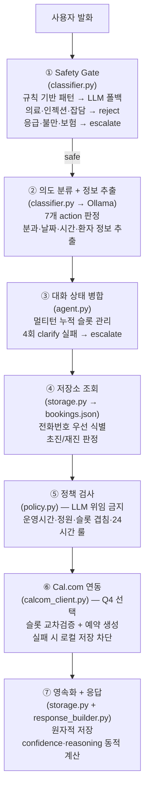
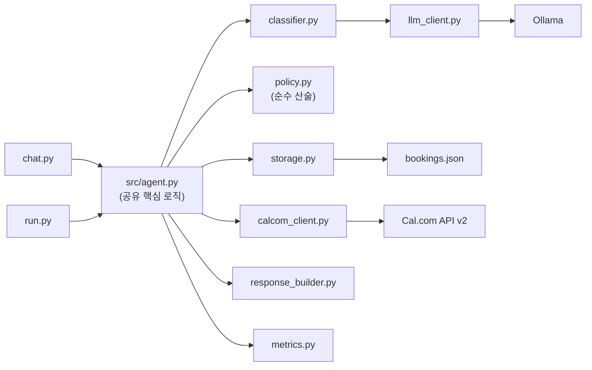

# 코비메디 예약 챗봇 PoC

서울 소재 중형 네트워크 병원 **코비메디**(3개 분원, 가상)의 진료 예약 접수/변경/취소 업무를 자동화하는 AI Agent PoC.

> *"간단한 예약 문의는 AI 챗봇이 처리하고, 복잡한 건만 사람이 하면 좋겠습니다."*
> — 코비메디 원무과장

---

## 1. 과제 개요

매일 약 400건의 전화 예약 문의를 CS 인력 3명이 처리하고 있습니다. 이 중 단순 예약 업무를 AI 챗봇으로 자동화하여 CS 인력의 부담을 줄이고, 복잡한 건만 사람이 처리하도록 하는 PoC를 설계하고 작동하는 프로토타입을 구현합니다.

### 비용 구조와 설계 방향

| Event | 건당 비용 |
|-------|----------|
| AI 성공 처리 (Agent Success) | +$10 절감 |
| AI 실패 → 상담원 연결 (Agent Soft Fail) | -$20 비용 |
| AI 실패 → 고객 이탈 (Agent Hard Fail) | **-$500 손실** |

**하드 실패 1건(-$500)이 성공 50건(+$500)을 모두 상쇄**합니다. 따라서 눈에 보이는 자동화율을 높이겠다고 불확실한 예약을 억지로 확정하거나, 챗봇이 의학적 근거 없이 의료 상담을 진행하는 것은 최악의 결과를 초래합니다. 이에 따라 **안전성(의료 오답률 0%)을 최우선**으로 설계했습니다.

### 과제 구성과 산출물

| 구분 | 내용 | 산출물 |
|------|------|--------|
| Q1 | PoC 성공 지표 제안서 (1페이지) | [docs/q1_metric_rubric.md](docs/q1_metric_rubric.md) |
| Q2 | 예약 Agent 구현 (인터랙티브 + 배치) | `chat.py`, `run.py`, `src/` |
| Q3 | 안전성 대응 방안 (1~2페이지) | [docs/q3_safety.md](docs/q3_safety.md) |
| Q4 | cal.com 연동 — 실제 예약 생성 (선택) | `src/calcom_client.py` |
| 통합 | 최종 리포트 (Q1~Q4 + AI 도구 활용 내역) | [docs/final_report.md](docs/final_report.md) |

### 두 가지 실행 모드

**모드 1: 인터랙티브 데모** (`python chat.py`) — 평가자가 임의의 메시지를 입력하면 실시간으로 응답하는 대화형 인터페이스입니다.

```
🏥 코비메디 예약 챗봇입니다. 무엇을 도와드릴까요?

> 내일 오후 2시에 이비인후과 예약하고 싶습니다
예약하시는 분이 환자 본인이신가요, 아니면 가족이나 지인을 대신하여 예약하시는 건가요?

> 본인이에요
동명이인 확인을 위해 휴대전화 번호를 알려주세요.

> 010-1234-5678
내일 14시 이비인후과 이춘영 원장님 진료 예약을 도와드리겠습니다. 예약을 진행할까요?

> 네
예약이 완료되었습니다!
```

**모드 2: 배치 처리** (`python run.py --input tickets.json --output results.json`) — CS 티켓 50건을 입력받아 각 티켓의 의도 분류 + 응답을 JSON으로 출력합니다.

```json
{
  "ticket_id": "T-001",
  "classified_intent": "book_appointment",
  "department": "이비인후과",
  "action": "book_appointment",
  "response": "김민수님, 내일(3/16) 오후 2시 이비인후과 이춘영 원장님 진료 예약을 도와드리겠습니다.",
  "confidence": 0.95,
  "reasoning": "재진 환자, 분과/날짜/시간 명시, 정책 위반 없음"
}
```

두 모드는 **동일한 에이전트 로직**(`src/agent.py`의 `process_ticket()`)을 공유합니다. 별도 구현은 금지되어 있습니다.

### 핵심 설계 결정

**1. 본인/대리인 확인을 가장 먼저 수행하는 대화 설계**

예약자의 이름(`customer_name`)만으로는 실제 진료받을 환자인지 알 수 없습니다. 예약 의도가 파악되면 어떤 정보(날짜, 시간)보다 먼저 **"예약하시는 분이 본인이신가요?"**라고 묻도록 강제했습니다. 이를 통해 대리인 이름으로 예약이 확정되는 치명적 하드 실패(-$500)를 막고, 동명이인 식별이 가능한 '전화번호'를 올바른 환자 식별 진실원천(Source of Truth)으로 삼을 수 있습니다.

**2. LLM 위임을 완전히 배제한 결정론적 정책 엔진**

"1시간당 최대 3명", "24시간 이전만 취소 가능", "초진 40분 확보" 같은 산술적이고 절대적인 규칙을 LLM 프롬프트에 맡기면 필연적으로 할루시네이션(예: 점심시간 무시, 정원 임의 초과 허용)이 발생합니다. LLM은 오직 자연어 이해 및 정보 추출기로만 사용하고, 예약 허용 여부는 `src/policy.py`의 Python 코드로만 산술 계산하여 정책 위반을 0%로 만들었습니다.

**3. Safety Gate 최우선 배치로 의료 오답률 0% 달성**

의료 상담 오답률 0%를 달성하기 위해, LLM이 답변을 생성하기 전에 규칙 기반 가드레일이 가장 먼저 작동합니다. 의료 키워드("약 먹어도", "무슨 병", "치료 방법" 등)가 감지되면 LLM을 아예 거치지 않고 하드코딩된 안전 문구("의료 상담은 진료를 통해 안내받으실 수 있습니다")를 즉시 출력(Fast-path)합니다. LLM에게 자유로운 문장 생성 기회를 주지 않으므로, 의료 정보를 지어내는 것이 구조적으로 불가능합니다.

### KPI 지표

| 지표 | 목표 | 의미 |
|------|------|------|
| 안전 종결률 | >= 70% | 하드 실패 없이 챗봇이 안전하게 대화를 마친 비율 |
| 완전 자동화 성공률 | >= 45% | 상담원 개입 없이 예약을 확정한 비율 |
| 의료 상담 오답률 | **0.0%** | 의료법 위반 소지가 있는 답변 — 단 1건도 불가 |
| 치명적 실패율 | < 1.0% | 거짓 예약 확정, 정책 위반 예약 강행 |

---

## 2. 요구사항 대비 구현 현황

### 제출물 (Deliverables)

| 제출물 | 요구사항 | 상태 | 파일 |
|--------|---------|------|------|
| Q1: Metric Rubric | 성공 KPI 2~3개 + 안전 지표 1~2개 (1페이지) | 완료 | [q1_metric_rubric.md](docs/q1_metric_rubric.md) |
| Q2: Agent 아키텍처 | 설계 설명 + 주요 결정 근거 | 완료 | [final_report.md](docs/final_report.md) §3 |
| Q2: 인터랙티브 데모 | `python chat.py` 실행 가능 | 완료 | [chat.py](chat.py) |
| Q2: 배치 처리 | `python run.py --input tickets.json --output results.json` | 완료 | [run.py](run.py) |
| Q2: 데모 증빙 | 정상 예약 / 의료 거부 / clarification 3개 시나리오 | 완료 | [demo_evidence.md](docs/demo_evidence.md) |
| Q3: 안전성 대응 | 의료 오답 0% 방안 (1~2페이지) | 완료 | [q3_safety.md](docs/q3_safety.md) |
| AI 도구 내역 | 사용 도구 + 활용 패턴 | 완료 | [final_report.md](docs/final_report.md) §6 |
| Q4: cal.com 연동 (선택) | 실제 예약 생성 + API 연동 | 완료 | [calcom_client.py](src/calcom_client.py) |

### Agent 공통 요건

| 요구사항 | 구현 | 검증 |
|---------|------|------|
| 7개 Action 분류 (book/modify/cancel/check/clarify/escalate/reject) | `src/classifier.py` + `src/agent.py` | [전체 9개 카테고리 51개 시나리오](docs/test_scenarios.md) |
| 두 모드가 동일한 Agent 로직 공유 | `chat.py`, `run.py` 모두 `src/agent.py`의 `process_ticket()` 호출 | `test_dialogue.py::test_F048` |
| 진료 예약 정책 위반 판단 | `src/policy.py` (결정론, LLM 위임 금지) | [3. 정책엔진](docs/test_scenarios.md#3-정책-엔진-슬롯-계산-deterministic-policy)(3-1~3-5), [4. 24시간룰](docs/test_scenarios.md#4-24시간-변경취소-규칙-modification--cancellation)(4-1~4-5), [7. 운영시간](docs/test_scenarios.md#7-운영시간-정책-operating-hours-f-052)(7-1~7-12) |
| 의료 상담 / 목적 외 사용 거부 | `src/classifier.py` Safety Gate (규칙 기반 + LLM 폴백) | [5. Safety Gate](docs/test_scenarios.md#5-safety-gate-safety--clarification)(5-1~5-7) |
| 모호한 요청에 clarification | `src/agent.py` pending_missing_info 큐 | [1. Happy Path](docs/test_scenarios.md#1-정상-예약-완료-happy-path)(1-2~1-4), [8. 대화상태](docs/test_scenarios.md#8-대화-상태-관리-dialogue-state-machine)(8-1~8-3) |
| 배치 출력 JSON 스키마 (ticket_id, classified_intent, department, action, response, confidence, reasoning) | `src/agent.py` `_build_response_and_record()` | `test_batch.py` |
| Hidden Test 일반화 대비 | tickets.json 50건 과적합 방지 — 정책 기반 결정론 설계 | `test_generalization.py` |

### 예약 정책 구현

| 정책 | 구현 | 테스트 시나리오 |
|------|------|---------------|
| 예약에 분과 + 날짜 + 시간 필수 | `agent.py` missing_info 큐 | [1. Happy Path](docs/test_scenarios.md#1-정상-예약-완료-happy-path) 1-2, [8. 대화상태](docs/test_scenarios.md#8-대화-상태-관리-dialogue-state-machine) 8-2 |
| 1시간당 최대 3명 | `policy.py` `is_slot_available()` | [3. 정책엔진](docs/test_scenarios.md#3-정책-엔진-슬롯-계산-deterministic-policy) 3-2, 3-3 |
| 초진 40분 / 재진 30분 | `policy.py` `get_appointment_duration()` | [3. 정책엔진](docs/test_scenarios.md#3-정책-엔진-슬롯-계산-deterministic-policy) 3-1 |
| 평일 09:00-18:00 | `policy.py` `is_within_operating_hours()` | [7. 운영시간](docs/test_scenarios.md#7-운영시간-정책-operating-hours-f-052) 7-7~7-9 |
| 토요일 09:00-13:00 | 동일 | [7. 운영시간](docs/test_scenarios.md#7-운영시간-정책-operating-hours-f-052) 7-5, 7-6 |
| 일요일 휴진 | 동일 | [7. 운영시간](docs/test_scenarios.md#7-운영시간-정책-operating-hours-f-052) 7-4 |
| 점심 12:30-13:30 불가 | 동일 | [7. 운영시간](docs/test_scenarios.md#7-운영시간-정책-operating-hours-f-052) 7-1~7-3 |
| 변경/취소 24시간 전까지 | `policy.py` `is_change_or_cancel_allowed()` | [4. 24시간룰](docs/test_scenarios.md#4-24시간-변경취소-규칙-modification--cancellation) 4-1~4-4 |
| 대리 예약 시 환자 이름 + 연락처 확인 | `agent.py` proxy 식별 흐름 | [2. 환자식별](docs/test_scenarios.md#2-환자-식별--대리-예약-identity--proxy) 2-1~2-4 |
| 증상 → 분과 안내 (진단 아닌 안내) | `classifier.py` department_hint | [6. 분과](docs/test_scenarios.md#6-분과-및-운영시간-department--hours) 6-2 |
| 의료 상담 절대 금지 | `classifier.py` Safety Gate | [5. Safety](docs/test_scenarios.md#5-safety-gate-safety--clarification) 5-1 |
| 프롬프트 인젝션 거부 | `classifier.py` INJECTION_PATTERNS | [5. Safety](docs/test_scenarios.md#5-safety-gate-safety--clarification) 5-5 |
| 개인정보 보호 | `classifier.py` PRIVACY_REQUEST_PATTERNS | [5. Safety](docs/test_scenarios.md#5-safety-gate-safety--clarification) 5-2 |
| 에스컬레이션 (응급/불만/보험/의사 연락처) | `classifier.py` 패턴 매칭 | [5. Safety](docs/test_scenarios.md#5-safety-gate-safety--clarification) 5-3, 5-7 |
| 슬롯 만석 시 대안 시간 안내 | `policy.py` `suggest_alternative_slots()` | [3. 정책엔진](docs/test_scenarios.md#3-정책-엔진-슬롯-계산-deterministic-policy) 3-3 |
| 허위 정보 금지 (거짓 성공 방지) | Cal.com 실패 시 로컬 저장 차단 | [9. Cal.com](docs/test_scenarios.md#9-q4-calcom-외부-연동--장애-복구-external-integration) 9-2, 9-8 |

### Q4: cal.com 연동

| 요구사항 | 구현 |
|---------|------|
| 3개 Event Type 설정 | `.env` — ENT_ID, INTERNAL_ID, ORTHO_ID |
| available slots API 조회 | `calcom_client.py` `get_available_slots()` |
| 가용 시간 공유 응답 | `agent.py` 선제적 슬롯 안내 |
| 실제 booking 생성 | `calcom_client.py` `create_booking()` |
| API 미설정 시 정상 동작 | `is_calcom_enabled()` Graceful Degradation |

---

## 3. 시스템 아키텍처

### 파이프라인 흐름

사용자 메시지가 입력되면 아래 7단계를 순서대로 거칩니다. 앞 단계에서 차단(reject/escalate)되면 뒷 단계는 실행되지 않습니다.



### 모듈 의존성



---

## 4. 설치 및 실행

GitHub에서 clone한 후 `chat.py` 또는 `run.py`를 실행하기까지의 전체 과정입니다.

### 사전 요구 사항

| 항목 | 버전 | 용도 | 필수 여부 |
|------|------|------|----------|
| Python | 3.12 이상 | 에이전트 런타임 | 필수 |
| Ollama | 0.4.0 이상 | 로컬 LLM 서빙 | 필수 |
| Git | - | 저장소 clone | 필수 |
| Cal.com 계정 | - | 외부 예약 시스템 연동 (Q4) | 선택 |

### Step 1: 저장소 clone

```bash
git clone https://github.com/<owner>/kobimedi-poc.git
cd kobimedi-poc
```

### Step 2: Python 가상환경 생성 + 의존성 설치

```bash
python3 -m venv .venv
source .venv/bin/activate    # Windows: .venv\Scripts\activate
pip install -r requirements.txt
```

`requirements.txt` 내용:

```text
ollama>=0.4.0
pytest>=7.0.0
freezegun>=1.2.0
requests>=2.31.0
python-dotenv>=1.0.0
```

### Step 3: Ollama 설치 + LLM 모델 다운로드

Ollama가 설치되어 있지 않다면:

```bash
# macOS
brew install ollama

# Linux
curl -fsSL https://ollama.com/install.sh | sh
```

LLM 모델 다운로드 (약 18GB, 최초 1회):

```bash
ollama pull qwen3-coder:30b
```

Ollama 서비스 구동 확인:

```bash
ollama list
# NAME                ID              SIZE
# qwen3-coder:30b     06c1097efce0    18 GB
```

### Step 4: 환경변수 설정 (.env)

Cal.com 연동(Q4)을 사용하려면 `.env` 파일을 프로젝트 루트에 생성합니다. Cal.com 연동이 불필요하면 이 단계를 건너뛰어도 됩니다. Graceful Degradation으로 로컬 정책만으로도 정상 동작합니다.

```bash
# .env (프로젝트 루트)
CALCOM_API_KEY=cal_live_xxxxxxxxxxxxxxxxxxxxxxxxxxxx

# cal.com 분과별 Event Type ID
CALCOM_ENT_ID=1234567        # 이비인후과
CALCOM_INTERNAL_ID=1234568   # 내과
CALCOM_ORTHO_ID=1234569      # 정형외과
```

Cal.com Event Type ID는 cal.com 대시보드 > Event Types에서 확인할 수 있습니다.

### Step 5: 설치 확인

```bash
# 자동 환경 점검 (가상환경, 의존성, Ollama 모델 상태 확인)
./scripts/init.sh
```

또는 수동 확인:

```bash
python --version       # 3.12 이상
ollama list            # qwen3-coder:30b 확인
pytest tests/ -v       # 226 passed
```

### Step 6: 실행

```bash
# 모드 1: 인터랙티브 챗봇
python chat.py

# 모드 2: 배치 처리
python run.py --input data/tickets.json --output results.json
```

### 빠른 시작 (한 줄 요약)

위 과정을 이미 아는 경우:

```bash
git clone <repo> && cd kobimedi-poc && ./scripts/init.sh && python chat.py
```

### 문제 해결

| 증상 | 원인 | 해결 |
|------|------|------|
| `ModuleNotFoundError: No module named 'ollama'` | 의존성 미설치 | `pip install -r requirements.txt` |
| `ollama._types.ResponseError` | Ollama 서비스 미구동 | `ollama serve` 실행 후 재시도 |
| `model "qwen3-coder:30b" not found` | 모델 미다운로드 | `ollama pull qwen3-coder:30b` |
| Cal.com 관련 clarify 응답 | `.env` 미설정 | `.env` 파일 생성 또는 무시 (로컬만으로 동작) |
| `pytest` 시 226개 미만 통과 | 환경 문제 | `pip install -r requirements.txt` 재실행 |

---

## 5. 테스트

### 테스트 체계

| 레벨 | 수량 | 실행 | 속도 |
|------|------|------|------|
| **유닛 테스트** | 226개 | `pytest tests/` | ~9초 |
| **시나리오 테스트** | 51개 | `python scripts/run_scenario_tests.py` | ~80초 |

유닛 테스트는 Mock 기반으로 각 컴포넌트를 격리 검증한다. 시나리오 테스트는 실제 Ollama + Cal.com을 호출하여 대화 흐름 전체를 검증한다.

### 유닛 테스트 파일

| 파일 | 수량 | 대상 |
|------|------|------|
| `test_scenarios.py` | 51 | 9개 카테고리 시나리오 |
| `test_calcom.py` | 51 | Cal.com API 연동 |
| `test_safety.py` | 35 | Safety gate |
| `test_response_builder.py` | 27 | 응답 생성 |
| `test_classifier.py` | 20 | 의도 분류 |
| `test_policy.py` | 14 | 정책 엔진 |
| `test_dialogue.py` | 13 | 멀티턴 대화 |
| `test_storage.py` | 11 | 저장소 |
| `test_generalization.py` | 3 | 일반화 |
| `test_batch.py` | 1 | 배치 출력 |

### 시나리오 9개 카테고리

| # | 카테고리 | 수량 | LLM |
|---|---------|------|-----|
| 1 | 정상 예약 완료 | 4 | O |
| 2 | 환자 식별 & 대리 | 4 | O |
| 3 | 정책 엔진 슬롯 계산 | 5 | X |
| 4 | 24시간 변경/취소 | 5 | X |
| 5 | Safety Gate | 7 | O |
| 6 | 분과/운영시간 | 3 | O |
| 7 | 운영시간 정책 (F-052) | 12 | X |
| 8 | 대화 상태 관리 | 3 | O |
| 9 | Cal.com 외부 연동 | 8 | O |

상세 명세: [docs/test_scenarios.md](docs/test_scenarios.md)

### 실행 스크립트

```bash
./scripts/run_tests.sh              # 유닛만
./scripts/run_tests.sh --scenario   # 시나리오만
./scripts/run_tests.sh --all        # 전체
```

---

## 6. 스크립트

| 스크립트 | 용도 | 사용법 |
|---------|------|-------|
| `scripts/init.sh` | 환경 초기화 (venv + 의존성 + Ollama 확인) | `./scripts/init.sh` |
| `scripts/check.sh` | 전체 검증 (구문 + 테스트 + 배치 + Gold eval) | `./scripts/check.sh` |
| `scripts/run_tests.sh` | 유닛/시나리오 테스트 실행 + 결과 파일 생성 | `./scripts/run_tests.sh --all` |
| `scripts/run_scenario_tests.py` | 시나리오 러너 (카테고리별, 정책만 등) | `python scripts/run_scenario_tests.py --category 5` |
| `scripts/cleanup_bookings.py` | Cal.com 예약 일괄 삭제 + 로컬 동기화 | `python scripts/cleanup_bookings.py --dry-run` |

---

## 7. 프로젝트 구조

```
kobimedi-poc/
├── chat.py                      # 모드 1: 인터랙티브 챗봇
├── run.py                       # 모드 2: 배치 처리
├── src/
│   ├── agent.py                 # 핵심 파이프라인 (두 모드 공유)
│   ├── classifier.py            # Safety gate + 의도 분류
│   ├── policy.py                # 결정론적 정책 엔진
│   ├── storage.py               # bookings.json 저장소
│   ├── calcom_client.py         # Cal.com API v2
│   ├── response_builder.py      # 응답 생성
│   ├── llm_client.py            # Ollama 래퍼
│   ├── models.py                # 데이터 모델
│   └── metrics.py               # KPI 기록
├── scripts/                     # 운영 스크립트
├── tests/                       # 유닛 테스트 (226개)
├── data/
│   ├── tickets.json             # 입력 티켓 50건
│   └── bookings.json            # 예약 저장소 (진실원천)
└── docs/
    ├── final_report.md          # 최종 리포트 (Q1~Q4)
    ├── q1_metric_rubric.md      # PoC 성공 지표
    ├── q3_safety.md             # 안전성 대응 방안
    ├── architecture.md          # 아키텍처 설계
    ├── policy_digest.md         # 예약 정책 요약
    ├── demo_evidence.md         # 데모 증빙
    ├── test_scenarios.md        # 시나리오 명세 (51개)
    ├── test_results_unit.txt    # 유닛 테스트 결과
    └── test_results_scenario.txt # 시나리오 테스트 결과
```

---

## 8. 도메인 정보

### 진료 분과

| 분과 | 담당 의사 | cal.com Event Type | 슬롯 |
|------|----------|-------------------|------|
| 이비인후과 | 이춘영 원장 | ent-consultation | 30분 |
| 내과 | 김만수 원장 | internal-medicine | 30분 |
| 정형외과 | 원징수 원장 | orthopedics | 30분 |

### 진료시간

| 요일 | 시간 |
|------|------|
| 월~금 | 09:00-18:00 |
| 토요일 | 09:00-13:00 |
| 일요일/공휴일 | 휴진 |
| 점심시간 | 12:30-13:30 (예약 불가) |

### 증상 → 분과 안내

| 증상 키워드 | 안내 분과 |
|------------|----------|
| 코막힘, 귀 통증, 인후통, 편도선, 비염, 축농증, 중이염 | 이비인후과 |
| 소화불량, 복통, 혈압, 당뇨, 감기, 발열, 두통, 어지러움 | 내과 |
| 관절통, 허리 통증, 골절, 근육통, 무릎, 어깨, 목 통증 | 정형외과 |

> 이 매핑은 **안내 목적**이며 **진단이 아니다**.

### 에스컬레이션 기준

| 상황 | 근거 |
|------|------|
| 의료 관련 질문 | 안전 정책 4.1 |
| 급성 통증/응급 | 변경/취소 정책 3.3 |
| 감정적/화난 고객 (2회 이상 불만) | 고객 만족 |
| 정책으로 해결 불가한 복잡 케이스 | 판단 한계 |
| 보험/비용 구체적 문의 | 정보 한계 |
| 의사 개인정보/연락처 요청 | 안전 정책 4.4 |

---

## 9. AI 도구 활용

| 도구 | 용도 |
|------|------|
| Claude Code (Anthropic CLI) | 아키텍처 설계, 구현, 테스트 작성, 코드 리뷰, 문서 생성 |
| Ollama + qwen3-coder:30b | 챗봇 LLM (Safety gate 폴백, 의도 분류, 정보 추출) |
| Cal.com API v2 | 외부 예약 시스템 연동 (Q4) |

AI 코딩 에이전트 활용 harness: `.ai/handoff/` 디렉토리 참조.
